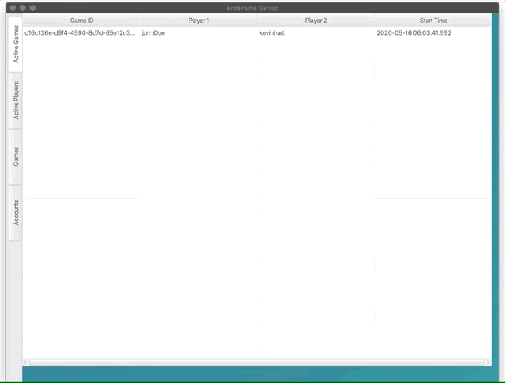
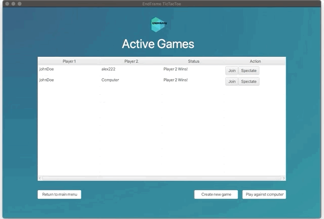
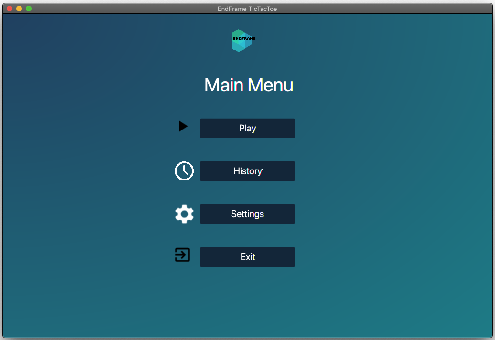

# EndFrame Tic Tac Toe Client/Server Desktop Application
- Semester long group project (team of 4) using Java and JavaFX.
- Presented deliverables at the end of each sprint using agile approach.

### Implements
- client/server architecture.
- microservice architecture for the different servers hosting the program.
- sockets and network programming. 
- multithreading.
- minimax algorithm to find the next optimal move for playing against the computer. 
- MySQL and JDBC

## Server Side Display

## Play Against Another Player

## Play Against Computer

## Spectate An Ongoing Game

## Main Menu

## Register New Account and Login

